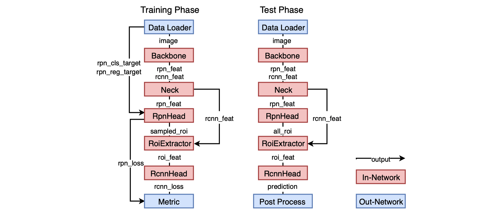

## SimpleDet - A Simple and Versatile Framework for Object Detection and Instance Recognition
### Major Features

- FP16 training for memory saving and up to **2.5X** acceleration
- Highly scalable distributed training available **out of box**
- Full coverage of state-of-the-art models including FasterRCNN, MaskRCNN, CascadeRCNN, RetinaNet, [DCNv1/v2](./models/dcn), **[TridentNet](./models/tridentnet)**, **[NASFPN](./models/NASFPN)** , **[EfficientNet](./models/efficientnet)**, and **[Kownledge Distillation](./models/KD)**
- Extensive feature set including **large batch BN**, **loss synchronization**, **automatic BN fusion**, soft NMS, multi-scale train/test
- Modular design for coding-free exploration of new experiment settings
- Extensive documentations including [annotated config](./doc/fully_annotated_config.py), [Fintuning Guide](./doc/FINETUNE.md)

### Recent Updates
- Add RPN test (2019.05.28)
- Add [NASFPN](https://github.com/TuSimple/simpledet/tree/master/models/NASFPN) (2019.06.04)
- Add new ResNetV1b baselines from GluonCV (2019.06.07)
- Add Cascade R-CNN with FPN backbone (2019.06.11)
- Speed up FPN up to 70% (2019.06.16)
- Update [NASFPN](https://github.com/TuSimple/simpledet/tree/master/models/NASFPN) to include larger models (2019.07.01)
- Automatic BN fusion for fixed BN training, saving up to 50% GPU memory (2019.07.04)
- Speed up MaskRCNN by 80% (2019.07.23)
- Update MaskRCNN baselines (2019.07.25)
- Add EfficientNet and DCN (2019.08.06)
- Add python wheel for easy local installation (2019.08.20)
- Add FitNet based Knowledge Distill (2019.08.27)
- Add SE and train from scratch (2019.08.30)
- Add a lot of docs (2019.09.03)

### Setup
#### Install
We provide a local installation here for Debian/Ubuntu system. To use a pre-built docker or singularity images, please refer to [INSTALL.md](./doc/INSTALL.md) for more information.

```bash
# install dependency
sudo apt update && sudo apt install -y git wget make python3-dev libglib2.0-0 libsm6 libxext6 libxrender-dev unzip

# install python dependency
pip3 install 'matplotlib<3.1' opencv-python pytz --user

# download and intall pre-built wheel for CUDA 10.0
# check INSTALL.md for wheels for other CUDA version
wget https://bit.ly/2jRGqdc -O mxnet_cu100-1.6.0b20190820-py2.py3-none-manylinux1_x86_64.whl
pip3 install mxnet_cu100-1.6.0b20190820-py2.py3-none-manylinux1_x86_64.whl --user

# install pycocotools
pip3 install 'git+https://github.com/RogerChern/cocoapi.git#subdirectory=PythonAPI' --user

# install mxnext, a wrapper around MXNet symbolic API
pip3 install 'git+https://github.com/RogerChern/mxnext#egg=mxnext' --user

# get simpledet
git clone https://github.com/tusimple/simpledet
cd simpledet
make

# test simpledet installation
mkdir -p experiments/faster_r50v1_fpn_1x
python3 detection_infer_speed.py --config config/faster_r50v1_fpn_1x.py --shape 800 1333
```

If the last line execute successfully, the average running speed of Faster R-CNN R-50 FPN will be reported. And you have successfuly setup SimpleDet. Now you can head up to the next section to prepare your dataset.


#### Preparing Data
We provide a step by step preparation for the COCO dataset below.
```bash
cd simpledet
mkdir -p data/coco/images data/src

# skip this if you have the zip files
wget http://images.cocodataset.org/zips/train2017.zip -O data/src/train2017.zip
wget http://images.cocodataset.org/zips/val2017.zip -O data/src/val2017.zip
wget http://images.cocodataset.org/zips/test2017.zip -O data/src/test2017.zip
wget http://images.cocodataset.org/annotations/annotations_trainval2017.zip -O data/src/annotations_trainval2017.zip
wget http://images.cocodataset.org/annotations/image_info_test2017.zip -O data/src/image_info_test2017.zip

unzip data/src/train2017.zip -d data/coco/images
unzip data/src/val2017.zip -d data/coco/images
unzip data/src/test2017.zip -d data/coco/images
unzip data/src/annotations_trainval2017.zip -d data/coco
unzip data/src/image_info_test2017.zip -d data/coco

python3 utils/create_coco_roidb.py --dataset coco --dataset-split train2017
python3 utils/create_coco_roidb.py --dataset coco --dataset-split val2017
python3 utils/create_coco_roidb.py --dataset coco --dataset-split test-dev2017

```

For other datasets or your own data, please check [DATASET.md](doc/DATASET.md) for more details.

#### Quick Start

```bash
# train
python3 detection_train.py --config config/faster_r50v1_fpn_1x.py

# test
python3 detection_test.py --config config/faster_r50v1_fpn_1x.py
```

#### Finetune
Please check [FINTUNE.md](doc/FINETUNE.md)


### Project Design
#### Model Zoo
Please refer to [MODEL_ZOO.md](./MODEL_ZOO.md) for available models

#### Code Structure
```
detection_train.py
detection_test.py
config/
    detection_config.py
core/
    detection_input.py
    detection_metric.py
    detection_module.py
models/
    FPN/
    tridentnet/
    maskrcnn/
    cascade_rcnn/
    retinanet/
mxnext/
symbol/
    builder.py
```
#### Config
Everything is configurable from the config file, all the changes should be **out of source**.

#### Experiments
One experiment is a directory in **experiments** folder with the same name as the config file.
> E.g. r50_fixbn_1x.py is the name of a config file

```
config/
    r50_fixbn_1x.py
experiments/
    r50_fixbn_1x/
        checkpoint.params
        log.txt
        coco_minival2014_result.json
```

#### Models
The `models` directory contains SOTA models implemented in SimpletDet.

### Distributed Training
Please refer to [DISTRIBUTED.md](./doc/DISTRIBUTED.md)

#### How is Faster R-CNN built


**Simpledet** supports many popular detection methods and here we take [**Faster R-CNN**](https://arxiv.org/abs/1506.01497) as a typical example to show how a detector is built.

- *Preprocessing*. The preprocessing methods of the detector is implemented through `DetectionAugmentation`.
  - Image/bbox-related preprocessing, such as `Norm2DImage` and `Resize2DImageBbox`.
  - Anchor generator `AnchorTarget2D`, which generates anchors and corresponding anchor targets for training RPN.
- *Network Structure*. The training and testing symbols of Faster-RCNN detector is defined in `FasterRcnn`. The key components are listed as follow:
  - *Backbone*. `Backbone` provides interfaces to build backbone networks, *e.g.* ResNet and ResNext.
  - *Neck*. `Neck` provides interfaces to build complementary feature extraction layers for backbone networks, *e.g.* `FPNNeck` builds Top-down pathway for [Feature Pyramid Network](https://arxiv.org/abs/1612.03144).
  - *RPN head*. `RpnHead` aims to build classification and regression layers to generate proposal outputs for RPN. Meanwhile, it also provides interplace to generate sampled proposals for the subsequent R-CNN.
  - *Roi Extractor*. `RoiExtractor` extracts features for each roi (proposal) based on the R-CNN features generated by `Backbone` and `Neck`.
  - *Bounding Box Head*. `BboxHead` builds the R-CNN layers for proposal refinement.

#### How to build a custom detector
The flexibility of **simpledet** framework makes it easy to build different detectors. We take [**TridentNet**](https://arxiv.org/abs/1901.01892) as an example to demonstrate how to build a custom detector simply based on the Faster R-CNN framework.

- *Preprocessing*. The additional processing methods could be provided accordingly by inheriting from `DetectionAugmentation`.
  - In TridentNet, a new `TridentAnchorTarget2D` is implemented to generate anchors for multiple branches and filter anchors for scale-aware training scheme.
- *Network Structure*. The new network structure could be constructed easily for a custom detector by modifying some required components as needed and
  - For TridentNet, we build trident blocks in the `Backbone` according to the descriptions in the paper. We also provide a `TridentRpnHead` to generate filtered proposals in RPN to implement the scale-aware scheme. Other components are shared the same with original Faster-RCNN.


### Contributors
Yuntao Chen, Chenxia Han, Yanghao Li, Zehao Huang, Yi Jiang, Naiyan Wang


### License and Citation
This project is release under the Apache 2.0 license for non-commercial usage. For commercial usage, please contact us for another license.

If you find our project helpful, please consider cite our tech report.
```
@article{chen2019simpledet,
  title={SimpleDet: A Simple and Versatile Distributed Framework for Object Detection and Instance Recognition},
  author={Chen, Yuntao and and Han, Chenxia and Li, Yanghao and Huang, Zehao and Jiang, Yi and Wang, Naiyan and Zhang, Zhaoxiang},
  journal={arXiv preprint arXiv:1903.05831},
  year={2019}
}
```
