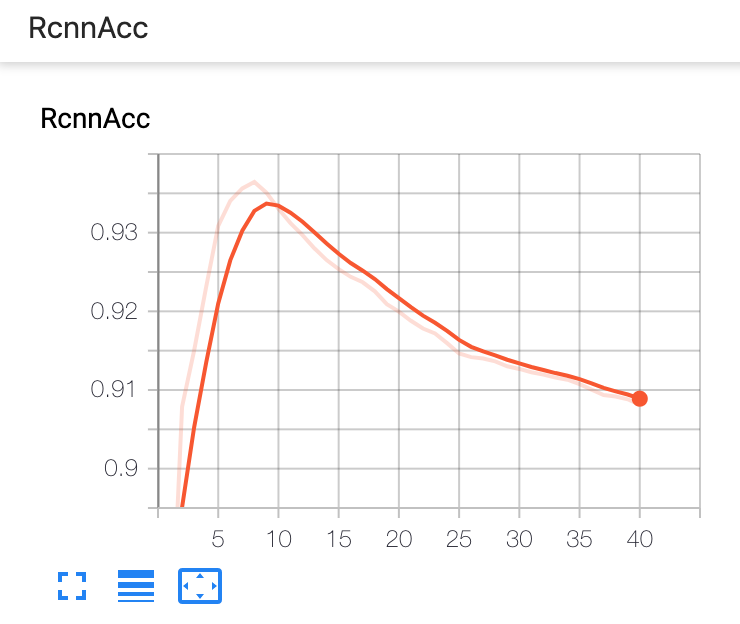

## Introduction

### Setup tensorboard
```bash
pip3 install mxboard tensorboard --user
```

### Modify your config
You need to import the `SummaryWriter` and pass it to your metric in the config.

```python
from mxboard import SummaryWriter

# modify the logdir as you like
sw = SummaryWriter(logdir="./tflogs", flush_secs=5)  

rpn_acc_metric = metric.AccWithIgnore(
    name="RpnAcc",
    output_names=["rpn_cls_loss_output", "rpn_cls_label_blockgrad_output"],
    label_names=[],
    summary=sw
)
rpn_l1_metric = metric.L1(
    name="RpnL1",
    output_names=["rpn_reg_loss_output", "rpn_cls_label_blockgrad_output"],
    label_names=[],
    summary=sw
)
box_acc_metric = metric.AccWithIgnore(
    name="RcnnAcc",
    output_names=["bbox_cls_loss_output", "bbox_label_blockgrad_output"],
    label_names=[],
    summary=sw
)
box_l1_metric = metric.L1(
    name="RcnnL1",
    output_names=["bbox_reg_loss_output", "bbox_label_blockgrad_output"],
    label_names=[],
    summary=sw
)
mask_cls_metric = SigmoidCELossMetric(
    name="MaskCE",
    output_names=["mask_loss_output"],
    label_names=[],
    summary=sw
)
```


### Launch tensorborad on the shell
```bash
# you can specify the logdir in your 
tensorboard --logdir tflogs > /dev/null 2>&1  &

python detection_train --config path/to/your/config.py
```

Now open the web browser you can see the training curve like
